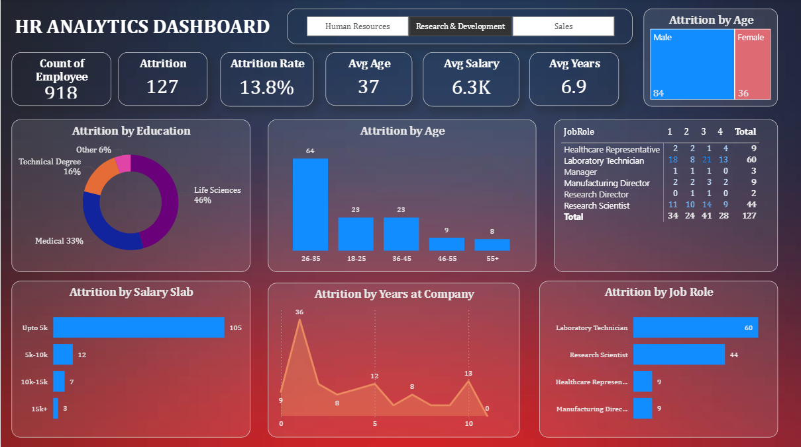

# HR Analytics Dashboard (Power BI)

## 📊 Project Overview
This project presents an interactive HR Analytics Dashboard built using Power BI to analyze employee attrition, performance, and lost revenue. The dashboard helps organizations make data-driven HR decisions through meaningful insights and visualizations.

## 🛠 Tools & Technologies Used
- Power BI
- DAX (Data Analysis Expressions)
- Excel (Data Cleaning & Preparation)

## 📌 Key Features
- Employee attrition rate analysis
- Department-wise performance insights
- Lost revenue calculation
- Interactive filters and visuals
- Data-driven decision support

## 📷 Dashboard Preview

## 🚀 How to Use
Download the .pbix file and open it using Microsoft Power BI Desktop to explore the dashboard.
